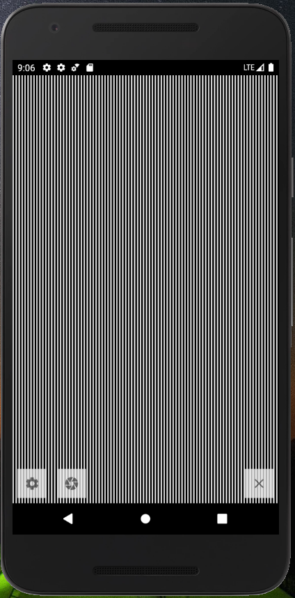

# ScanimationFilter
An overlay to check scanimations

Following app is quite simple yet usefull. It give you a posibility to check scanimations images (kinegrams, picket fence animations) either with use of camera or as an background overlay.

Some images of the app:
(zoom added later)

  

    

  
  AVAILABLE ON PLAY STORE
 (without zoom yet)
https://play.google.com/store/apps/details?id=com.diplabs.kinegramcam

LANGUAGES:
* JAVA + ANDROID
    
CREDITS:
//* CAMERA PROCESSING: camerakit  https://github.com/CameraKit/camerakit-android
  
    *as of 21.11.2021 chaneged to https://natario1.github.io/CameraView

    
    
    
